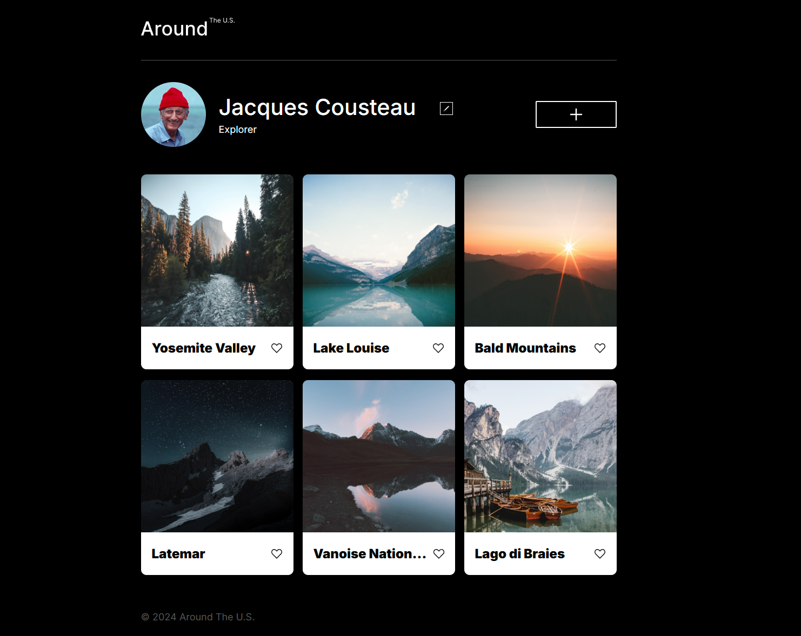
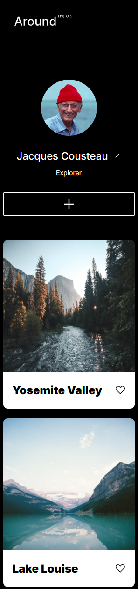
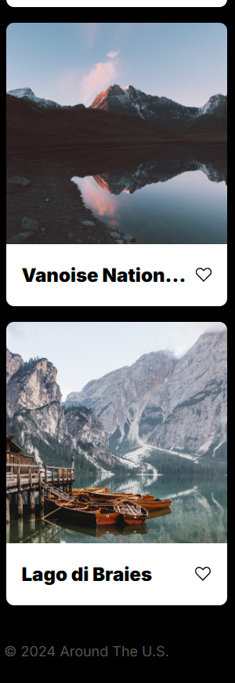

# Project 3: Around The U.S.

## Project Features

- Grid Layout
- Responsive Design with Desktop and Mobile Screens
- Screen Media Queries

### Overview

- Intro
- Figma
- Images
- GitHub Pages

**Intro**

This project is made so all the elements are displayed correctly on popular screen sizes.

**Figma**

- [Link to the project on Figma](https://www.figma.com/file/ii4xxsJ0ghevUOcssTlHZv/Sprint-3%3A-Around-the-US?node-id=0%3A1)

**Images**

The way you'll do this at work is by exporting images directly from Figma — we recommend doing that to practice more. Don't forget to optimize them [here](https://tinypng.com/), so your project loads faster.

Good luck and have fun!

**Github Pages**

-[Link to the project on Github Pages](https://dvalerio001.github.io/se_project_aroundtheus/)

#### Desktop Design

#### Mobiile Design

